# Boulder Dúo

Juego estilo Boulder Dash para el navegador, con gráficos al estilo C64 y pantalla dividida para dos jugadores en un mismo teclado.

Abre `index.html` en un navegador. No necesita instalar nada.

## Jugar con celular

Al abrirlo en un celular o tablet, el juego pregunta si quieres jugar con celular. Si dices que sí, te mueves **deslizando el dedo**: lo apoyas en cualquier parte de la pantalla (sobre tu tablero o fuera de él, arriba, abajo o a los lados, para no taparte la cueva) y lo arrastras hacia abajo, la izquierda, arriba o la derecha; mientras no lo levantes el minero sigue caminando, y para girar basta con arrastrar hacia el otro lado. Un círculo marca dónde pusiste el dedo y la flecha, la dirección. El botón **TÁCTIL** de arriba lo activa o desactiva y la elección se recuerda.

Solo o contra el PC se juega en **horizontal** (si el celular está en vertical, el juego pide girarlo). **De a dos (cooperativo o versus) se juega con el celular sobre la mesa, en vertical:** J1 tiene su tablero abajo y J2 arriba, dado vuelta para que lo vea derecho desde el otro lado de la mesa; cada uno desliza en su mitad de la pantalla (el dedo maneja el tablero más cercano, así que el borde de la mesa también sirve) y para J2 las direcciones también van al revés. En horizontal también se puede, con los tableros lado a lado.

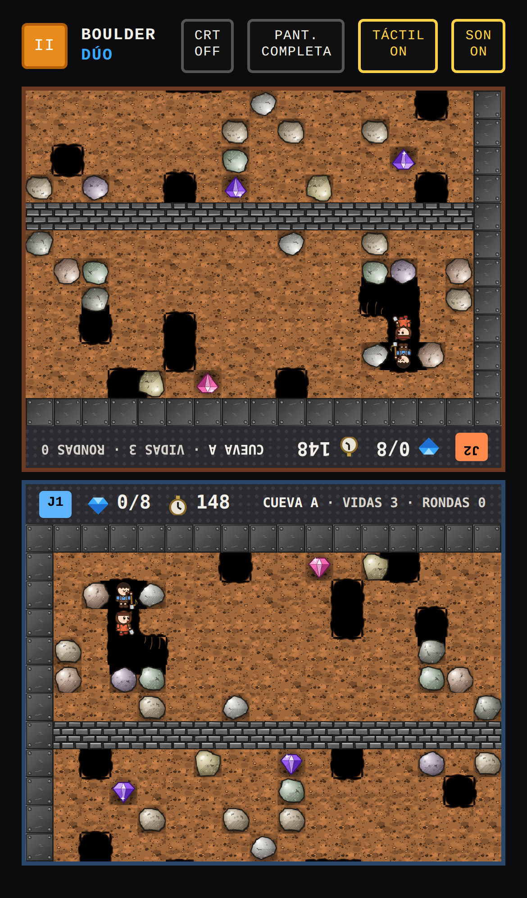

**Pantalla completa:** botón **PANT. COMPLETA** arriba (Android y computador). En iPhone, Safari no lo permite en páginas: hay que agregar el juego a la pantalla de inicio (Compartir → Agregar a inicio) y abrirlo desde ahí, y se abre sin barras. En pantalla completa el celular queda fijo en vertical para jugar de a dos y en horizontal para jugar solo o contra el PC (en Android; en iPhone no se puede fijar). Además desaparece la barra de arriba y queda un solo botón redondo al medio, entre los tableros, para pausar; la pausa tiene CONTINUAR, SALIR AL MENÚ, SONIDO y SALIR DE PANTALLA COMPLETA.

La salida está escondida en la fila de abajo del mapa y aparece al juntar las gemas necesarias: suena una fanfarria, sale el aviso «¡SALIDA ABIERTA!» y, si no está en pantalla, una flecha en el borde del tablero apunta hacia ella.

Las rocas y gemas quietas esperan un tick antes de empezar a caer cuando les quitan el piso, así alcanzas a salir de debajo.

## Cuevas

Como en Boulder Dash 2, los niveles son cuevas con letra, de la **A** a la **P**, y cada una tiene sus propios colores C64 para la tierra, el muro de ladrillo y el acero. Después de la P se vuelve a la A con más dificultad (A2, B2…). El mapa de cada cueva lo sigue armando el generador del juego.

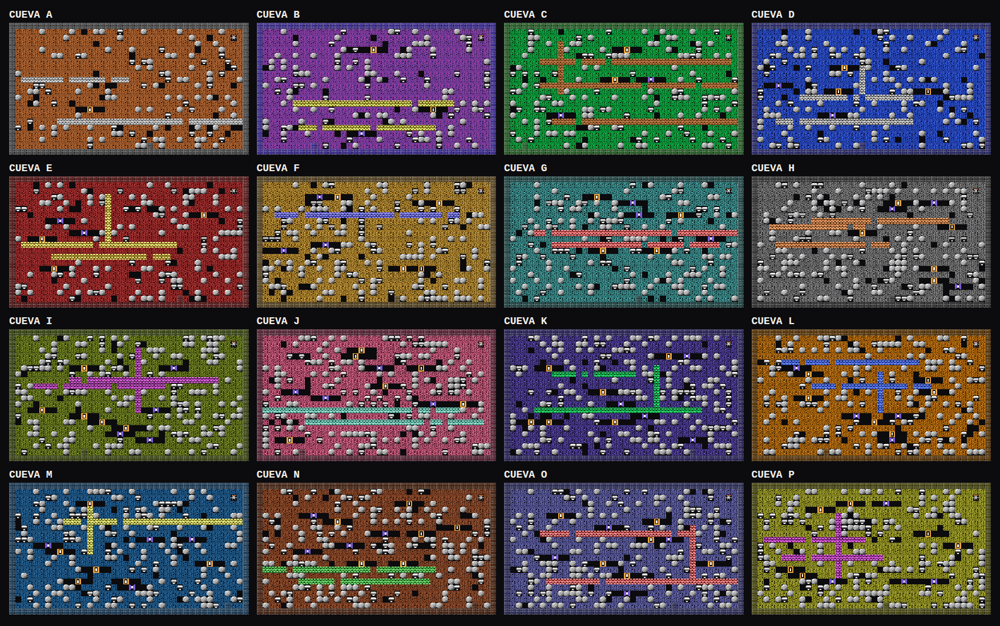

Empujar una roca no cuesta siempre lo mismo: en cada tick que empujas se mueve con probabilidad 1/2, así que en promedio tarda dos ticks (lo que tarda una roca en empezar a caer y bajar una casilla); con suerte se mueve de inmediato, incluso si va cayendo junto a ti. En Entrenar PC se mantiene la regla fija de dos ticks.

Cada jugador tiene su propio reloj: el paso empieza apenas aprietas (si el anterior ya terminó), sin esperar el tick de la cueva. Las rocas, diamantes y enemigos siguen el reloj de la cueva, así que el minero y el mundo no se mueven en el mismo instante. Un paso dura lo mismo que un tick. Las reglas no cambian; por ejemplo, la roca que se queda sin piso sigue esperando su tick antes de caer. En Entrenar PC todo sigue avanzando en ticks.

**Gravedad.** Siempre: lo que cae arranca lento y acelera durante la primera casilla, las rocas giran al rodar y al aterrizar se aplastan un poco, rebotan y levantan polvo (solo dibujo). Opcional, con el botón **GRAVEDAD REAL** del menú: lo que cae acelera de verdad, una casilla en su primer tick, dos en el siguiente y tres desde ahí; escapar de una roca que viene de lejos es más difícil, y si vas cavando hacia abajo con una roca cayendo encima, te alcanza y te aplasta. Además, una roca que cae 6 casillas o más rompe la casilla con que choca (tierra, ladrillo u otra roca; el acero, la salida y los diamantes aguantan) y se deshace en tierra que tapa ese agujero, con polvo y un pequeño temblor. Solo en las cuevas originales.

La velocidad depende del nivel de dificultad de la cueva: un tick dura 170 ms en el nivel 1, 145 en el 2, 120 en el 3, 105 en el 4 y 92 en el 5 (el modo Entrenar PC sigue en 120 ms). El reloj de la cueva va al mismo ritmo que el juego: en el nivel 3 cuenta segundos reales, en el nivel 1 cada segundo dura 1,4 s de verdad y en el 5 apenas 0,77 s, igual que los pasos de los niños.

**¡Oh no!** Cuando algo atrapa al niño o a la niña (una roca o gema que le cae encima, una luciérnaga o mariposa, una explosión), no explota de golpe: el atrapado y lo que lo atrapó (todo lo que está en el 3×3 de la explosión que viene) se quedan quietos unos 3 ticks (al menos medio segundo) mientras dice "¡OH NO!" en un globito con un sonido de alarma, y recién entonces explota. El resto de la cueva y el otro jugador siguen normalmente. Solo aparece cuando de verdad muere. Con la última vida, la pantalla de fin aparece un segundo después de la explosión. (El entrenamiento del PC y el modo turbo explotan al instante, como el simulador de Python.)

El movimiento se dibuja suave: cada roca, gema, enemigo o minero se desliza de su casilla a la nueva durante el tick (unos 7 cuadros a 60 Hz), sin cambiar la mecánica, que sigue avanzando de a una casilla por tick.

Los jugadores son un niño (J1, azul) y una niña (J2, naranja), personajes propios con un estilo suave de película animada, dibujados a 64×64 dentro de cada casilla de 16×16. Los tableros se dibujan a 4× para que se vean finos sin perder el estilo C64 del resto.

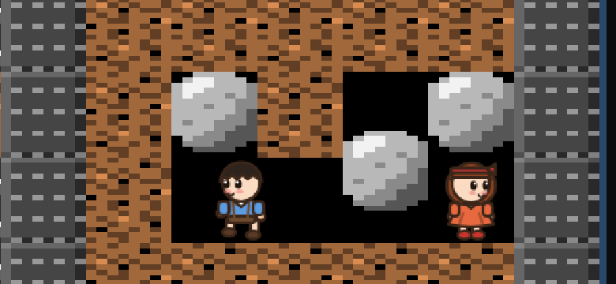

Los dos llevan una pala y la mueven hacia donde cavan (a los lados, arriba o abajo); la tierra se va abriendo desde el centro de la casilla hacia los bordes durante el tick. Las rocas, diamantes, luciérnagas, mariposas, explosiones y la tierra también están dibujados a 64×64, con trazo y sombreado de lápiz como hechos a mano. Hay 8 tipos de roca, diamantes de 6 colores y 16 mariposas cuyas alas pasan de un color a otro en un degradado de dirección al azar; a cada objeto le toca uno al azar y lo conserva al moverse. Todos funcionan igual: solo cambia el dibujo.

Los bordes de la tierra que dan a un hueco son ondulados y con trazo de lápiz, y las esquinas de los huecos son redondeadas.

Los muros de ladrillo y el acero (placas remachadas) también están dibujados a mano. Las rocas y diamantes quietos se ven encajados en la tierra: detrás tienen tierra con sombra y solo se abren hacia las casillas vacías; las rocas se dibujan un poco más grandes para que las vecinas se toquen.

Si nadie toca los controles, cada niño arma un plan al azar: tras un momento hace algunas de estas cosas en orden y duración al azar (mirar a los lados, saludar, silbar marcando el paso con el pie, bostezar). Al final se aburren: la mitad de las veces se quedan dormidos apoyados en la pala y si no, el niño saca una pelota y juega a lanzarla y la niña se pone a leer un libro. Si la niña está quieta a pocas casillas en la misma fila, sin nada entre ellos, el niño en vez de la pelota saca una honda y le tira una bolita de papel; ella cierra los ojos y dice «¡AY!», deja lo que estaba haciendo y se da vuelta enojada mostrándole el puño, mientras él esconde la honda y se pone a silbar mirando para otro lado. Al rato lo vuelve a intentar.

La primera vez que se empuja una roca, a veces (la mitad de las veces) aparece algo que vivía debajo: un topo que se asusta, corre por el túnel y se mete cavando un hoyo en el suelo, dos bolitas de hollín que saltan y se meten de vuelta en la tierra, o un gusano que asoma la cabeza desde el suelo, mira a los lados y se esconde. Es solo dibujo.

Si los dos niños se quedan quietos uno al lado del otro, juegan piedra, papel o tijera: estiran el brazo hacia el otro y agitan el puño al ritmo de «piedra, papel, tijera», muestran la mano (puño, mano abierta o dos dedos), el que gana celebra y el marcador queda sobre ellos.

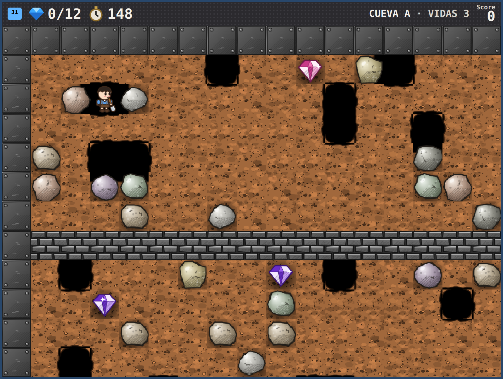 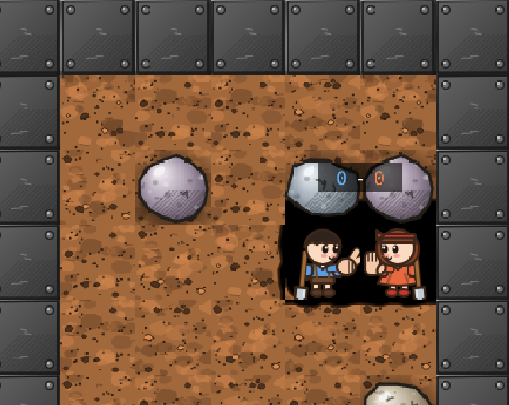 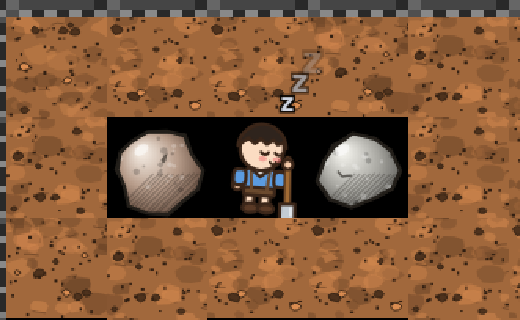

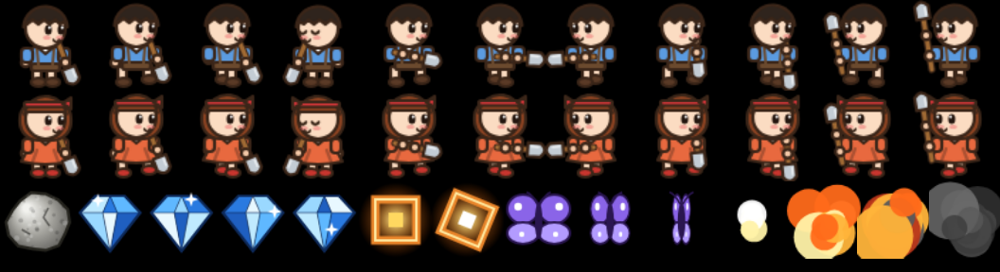

## Extras

- **PC: EXPERTO / APRENDIZ** (botón del menú). El **experto** es el A\* con costos de peligro de `rl/boulder/policy.py`, portado al juego y con los costos ajustados con CEM (`rl/tune_astar.py`); en el juego además puede empujar rocas. El **aprendiz** es el Q(λ) que aprende paso a paso.
- **El experto aprende cada cueva (RL de alto nivel).** Con EXPERTO activo, **ENTRENAR PC** pone al PC a intentar una y otra vez la cueva elegida en ELEGIR CUEVA. En cada decisión elige qué hacer —ir a una gema, ir a la salida, empujar una roca, cavar bajo una roca para soltarla, o esperar— y el A\* lo lleva hasta ahí sin morir. Cada intento repite el mejor plan encontrado hasta ahora y cambia una decisión; al final de cada vida puntúa las decisiones con lo que vino después (gemas +5, salida +60, muerte −40, −0,05 por tick). Lo aprendido se guarda por cueva en el navegador y lo usa en «Contra PC». El panel muestra intentos, salidas, muertes, gemas, el mejor plan y una curva por intento; con x10, x100 y MÁX entrena más rápido.
  Además de ir a gemas o a la salida, empujar rocas, soltar una roca o esperar, puede **cavar un pozo bajo una roca** (de abajo hacia arriba, saliendo siempre por el costado) para dejarla caer hasta el fondo sobre un enemigo; cada enemigo aplastado le suma +8. Cuando no tiene gemas a su alcance no se queda esperando: prueba primero lo que aún no ha intentado. Así resuelve la cueva D («Butterflies»): suelta rocas sobre las mariposas, junta 27 gemas y sale.
  Con 150 intentos por cueva, jugando solo las 41 cuevas: sin aprender sale en 16 y junta 327 gemas; después de aprender sale en 21 y junta 539. En algunas cuevas el plan aprendido arriesga más y muere.

  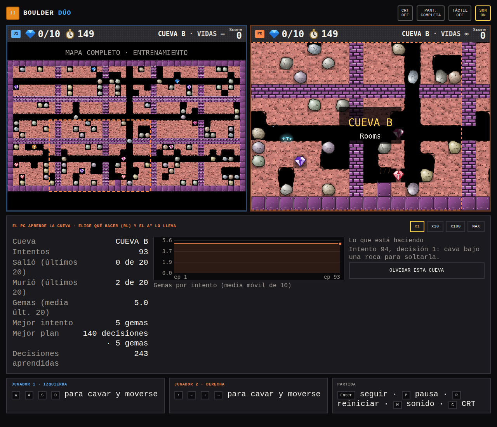

- **AMIGABLE** (botón del menú): las luciérnagas y mariposas no hacen daño (ni sus explosiones) y los diamantes que caen en la cabeza se atrapan y se cuentan. Solo una roca que cae aplasta.

- **Intermedios de bonus:** si en un intermedio se acaba el tiempo o mueren, no se pierden vidas y se sigue a la cueva siguiente.

- **Cueva M\*** (en Boulder Dash 1, después de la M): una variante de «Apocalypse» con un nido en el medio de la hilera de mariposas: cada vez que se libera una casilla a su lado, sale una mariposa nueva (hasta 8 más que las de la hilera original). Cada mariposa aplastada con una roca da diamantes.
- **Estrellas coleccionables:** cada cueva tiene una estrella con su letra. Si la cueva tiene enemigos, el más lejano de la entrada es el «jefe»: lleva una coronita dorada y al hacerlo explotar (con una roca, o al tocar a alguien) suelta la estrella. Si no hay enemigos, la estrella está escondida en un lugar difícil: lejos, bajo una roca (al tomarla la roca cae) y rodeada de muros. Si el jefe es una mariposa, la estrella cuenta además como el diamante que reemplazó, para que siempre alcancen los diamantes. No hace falta para salir, pero queda guardada y se ve en ELEGIR CUEVA (★ y «Estrellas: n de 21»).

  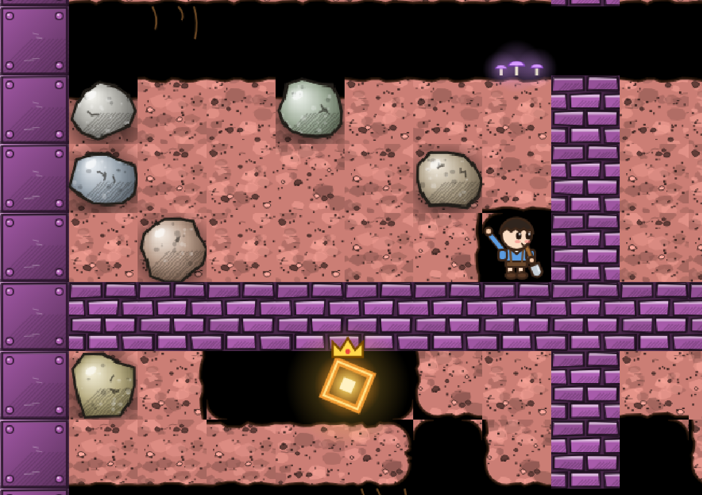 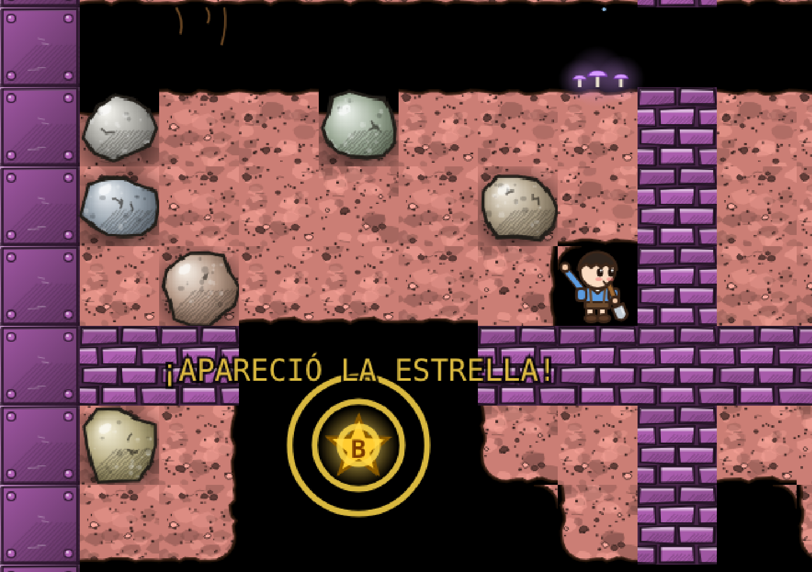
- **Diamantes que vuelan** al contador al recogerlos, y anillos dorados cuando se abre la salida.
- **Cueva viva:** hongos que brillan en el suelo, raíces colgando del techo y gotas que caen y salpican (solo dibujo).
- **ACERCAR** (botón del menú): la cámara se acerca un 25 %: los dibujos se ven más grandes pero ves unas 13½ × 9½ casillas en vez de 17 × 12, así que hay menos tiempo para ver venir las rocas y los enemigos. Más difícil. (El PC sigue viendo lo mismo de siempre.)
- **Gravedad cambiada** (opción oculta): en el computador, la tecla **G**; en el celular, **mantener presionado el botón de pausa** un momento (vibra). Cada vez la gravedad pasa a izquierda → arriba → derecha → sin gravedad → abajo (la normal). Las rocas y gemas caen y ruedan hacia ese lado, y se empujan de lado respecto a esa gravedad (con la gravedad a la izquierda se empujan hacia arriba o abajo); **sin gravedad nada cae y las rocas se empujan en cualquier dirección**. Un letrero muestra la dirección, y mientras no sea la normal queda una flechita en la esquina. El entrenamiento del PC siempre usa la gravedad normal.
- **OSCURIDAD** (botón del menú): la cueva queda a oscuras y solo se ve lo que alumbra la linterna de los niños, las luciérnagas, los diamantes, los hongos, la salida abierta y las explosiones.

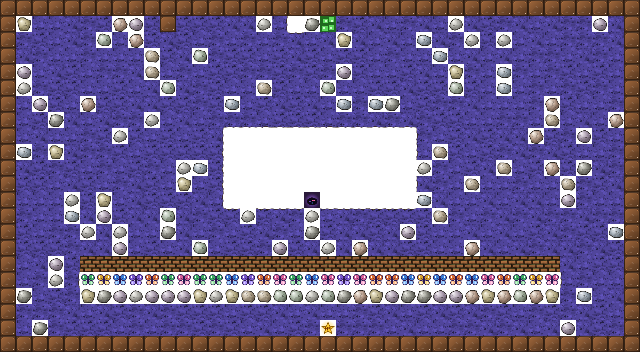 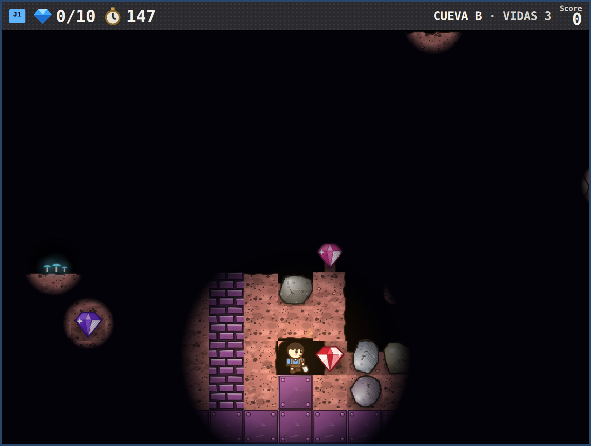

## Modos

- **1 jugador:** solo J1, con un único tablero más grande.
- **Cooperativo:** los dos juntan gemas para el equipo y salen por la puerta.
- **Versus:** cada uno junta sus gemas y gana el primero en salir.
- **Contra PC:** el rival aprende con Q(λ) mientras juegas.
- **Entrenar PC:** el PC juega solo. Se puede acelerar (x1, x10, x100 y MÁX) o usar **TURBO SIN PANTALLA**, que entrena sin dibujar y muestra solo parámetros y curvas de aprendizaje.

## Controles

| Jugador 1 | Jugador 2 | Partida |
|---|---|---|
| `W` `A` `S` `D` | Flechas | `Enter` seguir · `P` pausa · `R` reiniciar · `M` sonido · `C` CRT |

## El agente

- **Algoritmo:** Q(λ) de Watkins con trazas reemplazantes. Por defecto α = 0,15, γ = 0,93, λ = 0,3 y exploración ε-greedy con decaimiento.
- **Estado:** resume su pantalla de 17×12 casillas. Incluye qué hay en cada dirección y el tipo de peligro, el peligro en su propia casilla, el primer paso de la ruta segura más corta (BFS) hacia la gema o la salida más cercana con su distancia, el enemigo más cercano, si le cae una roca encima y cuántas gemas tiene a la vista.
- **Recompensas:** +5 por gema, +60 por salir, −40 por morir, −0,05 por paso, −0,3 por chocar con algo, y +0,4 por cada casilla que se acerca al objetivo.
- **Guardado:** lo aprendido se guarda en IndexedDB del navegador cada 15 segundos, con localStorage como respaldo.

## Entrenamiento fuera del navegador

`rl/` tiene lo necesario para entrenar al rival fuera del navegador:
- una copia en Python de la simulación, verificada tick a tick contra este `index.html`,
- un tokenizador de entidades,
- un transformer con PPO,
- un baseline con A\*.

Ver [`rl/README.md`](rl/README.md).
