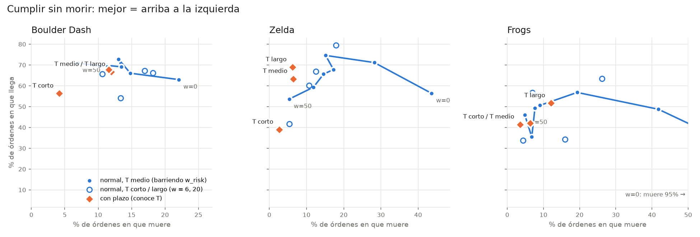

# Entrenar al PC con un transformer

Esta carpeta tiene lo necesario para entrenar al rival de Boulder Dúo con RL profundo, en vez de la tabla Q(λ) que corre dentro de `index.html`:
- una copia en Python de la simulación del juego,
- un tokenizador de entidades,
- un transformer entrenado con PPO.

```
cd rl
pip install -r requirements.txt
python -m pytest -q                                   # paridad con el juego + tokenizador
python train_ppo.py --name base --steps 2000000       # entrenar (Ctrl-C guarda y sale)
python train_ppo.py --name base --steps 4000000 --resume
python export_onnx.py --name base                     # → runs/base/policy.onnx
python baseline.py --lives 300                        # baseline con A*
```

## Archivos

| Archivo | Qué hace |
|---|---|
| `boulder/sim.py` | Copia de la física de `index.html` (modo "Entrenar PC"): generación de niveles con el mismo mulberry32, caídas, rodado, empuje, enemigos, explosiones, reaparición y reloj. |
| `boulder/env.py` | Entorno con API estilo Gymnasium. Un episodio es una vida del PC. |
| `boulder/tokens.py` | Convierte el estado en tokens de entidades con datos locales. |
| `boulder/model.py` | Transformer (d = 64, 3 capas, 4 cabezas, unos 107.000 parámetros). |
| `boulder/vec.py` | Entornos en varios procesos. |
| `train_ppo.py` | PPO con GAE. Guarda `runs/<nombre>/ckpt.pt` y `metrics.csv`. |
| `export_onnx.py` | Exporta la política para correrla en el navegador con onnxruntime-web. |
| `boulder/astar.py` | Dijkstra/A\* desde el PC hasta el objetivo más barato, con costos de peligro. |
| `baseline.py` | Política trivial con A\*: ir a la gema más barata y, con la cuota cumplida, a la salida. |
| `tests/` | Tests de paridad con el juego y del tokenizador. |

## Paridad con el juego

`tests/fixtures/js_traces.json` se genera con el juego real. `gen_js_traces.cjs` abre `index.html` en Chromium headless y lo maneja con el hook `window.__sim`. Son 6 niveles con 500 acciones cada uno, y se guarda un hash de la grilla y del agente en cada tick. `test_parity.py` exige que la versión Python dé los mismos hashes en los 3.000 ticks.

Si cambias la física en `index.html`, regenera las trazas y corre los tests:

```
NODE_PATH=$(npm root -g) node tests/gen_js_traces.cjs   # requiere el paquete playwright
python -m pytest -q
```

## Observación: tokens de entidades con datos locales

No hay tokens de terreno. El terreno entra como vecindario local de cada entidad, y así la observación queda en **32 tokens × 91 características**:

- **Token 0, el propio PC:** su vecindario y los datos globales (gemas respecto a la cuota, si la salida está abierta, tiempo restante, si es inmune, si viene una roca cayendo por su columna, el contador de empuje y las gemas a la vista).
- **Entidades de su pantalla (17×12),** ordenadas por cercanía: rocas, gemas, luciérnagas, mariposas, explosiones y la salida.
- **Fuera de pantalla:** hasta 4 gemas y la salida, marcadas como "fuera de vista".

Cada token de entidad lleva:
- su tipo,
- Δx y Δy con signo respecto al PC,
- la distancia Manhattan y la distancia BFS por casillas transitables,
- si está cayendo,
- hacia dónde se mueve (en el caso de los enemigos),
- si se puede empujar a la izquierda o a la derecha,
- las 8 casillas que lo rodean y la casilla 2 más abajo, en 7 clases: vacío, tierra, sólido, roca, gema, enemigo y jugador.

Ese vecindario es lo que permite distinguir una roca apoyada en tierra (inofensiva) de una roca sobre un hueco (va a caer). El detalle de cada columna está en `boulder/tokens.py`.

## Recompensas

Son las mismas del Q(λ) del juego, para poder comparar:

| Evento | Recompensa |
|---|---|
| Gema | +5 |
| Salir | +60 |
| Morir | −40 |
| Cada paso | −0,05 |
| Chocar con algo | −0,3 |
| Acercarse al objetivo | +0,4 por casilla |

"Acercarse al objetivo" se mide por la ruta segura más corta dentro de la pantalla hacia la gema más cercana, o hacia la salida si ya está abierta.

## Rendimiento en CPU (4 núcleos, sin GPU)

- **El entorno solo:** unos 1.900 pasos por segundo por proceso.
- **El entrenamiento completo:** unos 780 pasos por segundo, con 3 procesos de entornos × 8 entornos, 64 pasos por rollout, 4 épocas y minibatch de 512. Durante la actualización la red usa todos los núcleos.
- **Qué lo frena:** la mayor parte del tiempo se va en el backward del transformer. Con GPU o menos épocas debería subir bastante.

## Resultados hasta ahora

Todas las cifras usan la misma definición: un episodio es una vida del PC, en niveles del 1 al 12.

| Agente | Gemas por vida | Llega a la salida | Muere | Se le acaba el tiempo |
|---|---|---|---|---|
| PPO + transformer, 1,1 M de pasos (25 min en CPU) | 2,2 | 0 % | 14 % | 86 % |
| Q(λ) tabular del juego (λ = 0,3), unas 20.000 vidas | 10,4 | 18,5 % | 45 % | 36 % |
| **A\* trivial, peligro = 25** | **13,7** | **85 %** | **15 %** | **0 %** |
| A\* trivial, peligro = ∞ (prohibido) | 14,3 | 79 % | 7 % | 14 % |
| A\* trivial, peligro = 5 | 10,6 | 63 % | 30 % | 7 % |
| A\* trivial, peligro = 0 (lo ignora) | 7,1 | 34 % | 53 % | 13 % |

Cada fila de A\* promedia 300 vidas.

- **PPO con una acción por tick se vuelve pasivo:** aprende a no morir, pero junta pocas gemas y nunca sale.
- **El A\* sin nada aprendido supera por mucho al Q(λ).** Eso respalda cambiar el espacio de acciones: que la red elija un destino (un token) y A\* se encargue de llegar.
- **Qué aporta cada nivel de peligro:**
  - **Ignorarlo** mata al PC la mitad de las veces.
  - **Prohibirlo** lo deja atascado cuando la única ruta es riesgosa.
  - **Un costo alto (25)** equilibra las dos cosas.

Siguiente paso: acciones de alto nivel. La red apunta a un token (gema, salida, lado de una roca empujable, casilla de refugio o esperar), A\* con costos de peligro recalcula la ruta en cada tick, la acción termina al llegar, al desaparecer el destino o por peligro, y el entrenamiento es PPO semi-Markov. El baseline de A\* es la vara a superar.

## Destinos, CEM y predictor de muerte (nuestro juego)

Evaluación final: 800 vidas con semillas que no se usaron para ajustar.

| Agente | Gemas por vida | Salida | Muere | Se le acaba el tiempo |
|---|---|---|---|---|
| Red con destinos (PPO semi-Markov, unas 420.000 decisiones) | 16,9 | 68 % | 26 % | 6 % |
| A\* con reglas a mano | 12,1 | 74 % | 26 % | 0 % |
| A\* con reglas + CEM (`tune_astar.py`) | 20,1 | **100 %** | **0 %** | 0 % |
| A\* con predictor de muerte, sin CEM | 13,4 | 49 % | 0 % | 51 % |
| **A\* con predictor de muerte + CEM** | **29,2** | 93,5 % | **0 %** | 6,5 % |

- **El predictor de muerte** (`train_danger.py`) es una red que recibe un parche de 7×7 alrededor de la casilla. Sus etiquetas son contrafactuales, y salen de simular: "¿muere si entra ahí y se queda quieto 3 ticks?".
- **En niveles no vistos detecta más muertes que las reglas:** 87 % contra 70 % (F1 0,85 contra 0,75), con la misma precisión.

## GVGAI: el Boulder Dash de los papers

`gvgai/` conecta con el motor Java real de GVGAI (`bash gvgai/build.sh`) por medio de un puente: en cada tick, Python recibe el estado y devuelve la acción. También puede preguntarle al modelo del juego si una acción es mortal. Las reglas son las oficiales (`boulderdash.txt`):
- 1 vida,
- 9 diamantes y salir,
- 2.000 ticks,
- rocas que no ruedan,
- enemigos que se mueven al azar,
- 5 niveles de 26×13.

**Calibración** (`gvgai_baselines.py`, 25 partidas por agente con la máquina libre, 40 ms por acción):

| Agente | Nuestro montaje | Publicado ([GVGAI-LLM](https://arxiv.org/html/2508.08501v3)) |
|---|---|---|
| OLETS | 48 % | 56 % |
| sampleMCTS | 24 % | 28 % |

**Resultados** (`gvgai_eval.py` y `gvgai_danger.py eval`, 5 niveles × 20 semillas nuevas). El predictor y el CEM usaron solo los niveles 0 a 2; los niveles 3 y 4 son de prueba.

| Agente | Victorias | Por nivel (0 a 4) | Niveles no vistos (3 y 4) |
|---|---|---|---|
| OLETS (calibración) | 48 % | 1, 3, 1, 3, 4 de 5 | — |
| sampleMCTS (calibración) | 24 % | 0, 3, 1, 0, 2 de 5 | — |
| A\* sin costos de peligro | 17 % | 0, 8, 1, 0, 8 de 20 | — |
| **A\* con reglas de peligro a mano** | **90 %** | 17, 13, 20, 20, 20 de 20 | 100 % |
| A\* con predictor, sin CEM | 77 % | 0, 19, 18, 20, 20 de 20 | 100 % |
| A\* con predictor + CEM (niveles 0 a 2) | 88 % | 20, 17, 20, 20, 11 de 20 | 77,5 % |

**Cómo leerlo**
- **El A\* supera por mucho a OLETS y MCTS**, pero tiene una ventaja: ve el mapa entero y la política "gemas y después salida" es específica de Boulder Dash.
- **El predictor de muerte**, entrenado sin reglas escritas a mano, detecta el 46 % de las muertes en niveles no vistos, contra el 21 % de las reglas (F1 0,36 contra 0,08). Es más difícil que en nuestro juego porque los enemigos se mueven al azar.
- **El CEM sobreajusta** con solo 3 niveles de entrenamiento. Mejora los niveles 0 a 2, pero empeora el nivel 4. Para arreglarlo hay que ajustar sobre muchos niveles generados con el formato de GVGAI y dejar los 5 oficiales solo para la prueba.

### Sin sobreajuste: entrenar y ajustar solo en niveles generados

`boulder/gvgai_levels.py` genera niveles con el formato y las estadísticas de los oficiales. El A\* con reglas a mano gana 16 de 20 de ellos, una dificultad parecida a la de los oficiales. El predictor y los dos CEM usan **solo** 300 niveles generados, con 12 niveles nuevos por generación del CEM. Los 5 oficiales no se tocan hasta la evaluación.

```
python gvgai_danger.py collect --gen 300 --samples 120000
python gvgai_danger.py train --gen 300
python gvgai_danger.py tune --gen 300
python gvgai_danger.py eval --gen 300 --seeds 20
```

**El predictor en los 5 oficiales** (126.000 ejemplos de entrenamiento, 101.000 de prueba):

| | Detecta las muertes | Precisión | F1 |
|---|---|---|---|
| Reglas a mano | 28,7 % | 5,2 % | 0,09 |
| Red aprendida | **64,5 %** | **20,5 %** | **0,31** |

La red tiene un AUC de 0,936.

**Victorias en los 5 oficiales × 20 semillas:**

| Agente | Victorias | Por nivel (0 a 4) |
|---|---|---|
| OLETS (calibración) | 48 % | — |
| sampleMCTS (calibración) | 24 % | — |
| A\* con reglas a mano | 90 % | 17, 13, 20, 20, 20 |
| A\* con reglas + CEM (generados) | 88 % | 16, 12, 20, 20, 20 |
| A\* con predictor (generados), sin CEM | 78 % | 17, 17, 17, 20, 7 |
| **A\* con predictor + CEM (generados)** | **90 %** | 17, 17, 19, 20, 17 |

**Cómo leerlo**
- **Sin ninguna regla de peligro escrita a mano, y sin ver jamás los niveles oficiales,** el predictor aprendido con el modelo del juego, más el CEM, iguala a las reglas diseñadas a mano (90 %). Casi duplica a OLETS (48 %).
- **Con niveles generados, el CEM ya no sobreajusta:** antes daba 77,5 % en los niveles 3 y 4 no vistos, ahora da 92,5 %.
- **Las reglas a mano no mejoran con CEM** (88 % contra 90 %). Sus valores a mano ya estaban cerca de lo mejor.

## Agente genérico: sin conocimiento del juego (`boulder/generic.py`, `generic_train.py`)

El agente solo usa lo que da el motor de GVGAI:
- la grilla como conjuntos de tipos de sprite, con su categoría VGDL,
- la posición, el tipo y los recursos del avatar,
- el modelo del juego, para preguntar "¿muero si hago X?".

Todo lo demás lo aprende jugando:

| Qué aprende | Cómo |
|---|---|
| Qué se puede pisar | Por experiencia, sin contar los giros en el lugar de los avatares orientados |
| Los efectos de tocar cada tipo | Puntaje, recursos, cambio de avatar, y si gana o muere según los recursos y el avatar |
| Dónde hay peligro | Un predictor de muerte sobre planos por tipo: tick actual, tick anterior y sprites en movimiento |

En cada tick el objetivo se elige como **valor − `lam` · costo de la ruta**. El valor combina los efectos con 8 pesos globales, ajustados con CEM: en niveles generados para Boulder Dash, y en los niveles 0 a 2 para los demás juegos.

**Resultados en 5 niveles × 20 semillas:**

| Juego | Genérico | Genérico sin predictor | OLETS (nuestro montaje) | Agente específico |
|---|---|---|---|---|
| Boulder Dash | **68 %** (niveles 3 y 4: 82,5 %) | 9 % | 48 % | 90 % |
| Zelda | 49 % (niveles 3 y 4: 27,5 %) | 49 % | 88 % | — |
| Frogs | 0 % | 0 % | 96 % | — |

**Observaciones**
- **Sin saber nada de Boulder Dash**, el agente genérico supera a OLETS. Descubrió solo que tocar la salida con 10 recursos gana.
- **Los pesos a mano no sirven.** Probé 5 combinaciones razonadas y dieron entre 0 % y 20 %. Los del CEM (`w_risk` 6,9, `k_new` 11,3, `lam` 0,17) no se habrían adivinado.
- **En Zelda los 8 pesos se sobreajustan** a los 3 niveles de entrenamiento.
- **Frogs necesita planificar en el tiempo:** los troncos y los camiones se mueven, y el A\* planifica sobre una foto fija.

## El A\* como subordinado: seguir órdenes sin morir (`boulder/nav.py`, `nav_bench.py`)

El A\* no decide qué conviene. Recibe órdenes "ve a la casilla X" de un agente de alto nivel, que puede ser la red de punteros, una persona o un LLM, y tiene que cumplirlas sin morir. Solo sabe qué se puede pisar (aprendido) y dónde hay peligro (predictor de muerte aprendido).

**Cómo se mide.** Se dan órdenes al azar hacia destinos a 5 a 25 pasos, en los 5 niveles oficiales de GVGAI, unas 300 órdenes por fila. Cada orden termina en uno de cuatro resultados:
- **llegó:** alcanzó el destino con vida,
- **murió,**
- **tiempo agotado:** pasaron más de 3 × la distancia más corta + 20 ticks,
- **inalcanzable:** no hay ruta.

| Juego | Navegador | Llega | Muere | Tiempo agotado | Inalcanzable | Ruta / más corta |
|---|---|---|---|---|---|---|
| Boulder Dash | sin peligro | 49,8 % | **40,0 %** | 8,5 % | 1,6 % | 1,56 |
| Boulder Dash | predictor | 63,4 % | **18,8 %** | 13,1 % | 4,8 % | 1,81 |
| Boulder Dash | predictor + grilla (`w_risk` 40, `p_max` 0,5) | 58,4 % | **18,8 %** | 18,8 % | 4,1 % | 1,81 |
| Zelda | sin peligro | 61,9 % | **38,1 %** | 0 % | 0 % | 1,40 |
| Zelda | predictor | 68,7 % | **31,3 %** | 0 % | 0 % | 1,64 |
| Frogs | sin peligro | 4,3 % | **95,7 %** | 0 % | 0 % | 1,00 |
| Frogs | predictor | 13,9 % | **86,1 %** | 0 % | 0 % | 1,00 |

**Qué muestran**
- **Boulder Dash:** las muertes por orden bajan a menos de la mitad (40 % → 19 %). La grilla sobre niveles generados no mejoró a los valores a mano: prohíbe más pasos, así que más órdenes terminan por tiempo sin que bajen las muertes.
- **Zelda:** los enemigos se mueven al azar y el avatar no usa la espada, así que la mejora es menor (38 % → 31 %).
- **Frogs:** el peligro depende del tiempo. El predictor ve bien cada casilla, pero un A\* sobre una foto fija no puede sincronizarse con los troncos. Hace falta planificar en espacio y tiempo.

### Esperar: escudo de un paso y cubo del futuro

- **Escudo** (`shield` en `nav.py`): antes de cada paso, pregunta al modelo del juego si moverse en cada dirección o quedarse quieto lo mata (4 copias, 3 ticks). Si el paso elegido es riesgoso y hay una opción más segura, la toma, y a igual riesgo prefiere esperar.
- **Cubo del futuro** (`boulder/cube.py`): simula 30 ticks con el avatar quieto (3 simulaciones, conservando la unión) y busca con A\* sobre (casilla, tick), donde las acciones son 4 movimientos o esperar. El riesgo de cada casilla en cada tick sale de una regresión logística por tipo de sprite. Un sprite entre dos casillas marca las dos.

**Muertes por orden** (unas 200 órdenes por fila; unas 170 en las filas del cubo):

| Navegador | Boulder Dash | Zelda | Frogs |
|---|---|---|---|
| sin peligro | 38 % | 36 % | 96 % |
| solo escudo | 29 % | 15 % | 18 % |
| predictor | **18 %** | 29 % | 87 % |
| predictor + escudo | 19 % | **8 %** | 10 % |
| cubo + escudo | 21 % | **7 %** | **8 %** |

**Órdenes cumplidas (llega):**

| Navegador | Boulder Dash | Zelda | Frogs |
|---|---|---|---|
| sin peligro | 52 % | 64 % | 5 % |
| predictor | **65 %** | 71 % | 14 % |
| predictor + escudo | 63 % | 89 % | 33 % |
| cubo + escudo | 45 % | **92 %** | **46 %** |

**Qué muestran**
- **En Zelda y Frogs** el peligro viene hacia el avatar (enemigos, camiones), y saber esperar es lo que más baja las muertes.
- **En Boulder Dash** el peligro lo provoca el propio avatar al cavar. Ahí gana el predictor, que mira la geometría local, y el cubo no ayuda: simula con el avatar quieto, así que no ve las rocas que el avatar liberaría.
- **En Frogs sigue alto el tiempo agotado** (45 %) con el cubo. La exploración nunca llegó al río, así que no hay datos de agua ni de troncos, y además los troncos arrastran al avatar. Falta una segunda pasada de datos.

### Tiempo por decisión (`nav_bench.py <juego> --timing`)

Se mide solo el paso del navegador, incluidas las consultas al modelo del juego. La máquina estaba libre, con 2 procesos. El límite de la competencia GVGAI es 40 ms por acción.

**Media / p95 en ms:**

| Navegador | Boulder Dash | Zelda | Frogs |
|---|---|---|---|
| sin peligro | 1,1 / 1,7 | 0,4 / 0,6 | 1,3 / 2,7 |
| predictor | 11,1 / 17,1 | 3,8 / 6,0 | 15,7 / 24,2 |
| predictor + escudo | 21,2 / 32,5 | 7,2 / 12,7 | 19,1 / 29,7 |
| cubo + escudo | 48,3 / 65,5 | 16,1 / 25,3 | 44,1 / 79,8 |

**Decisiones que pasan de 40 ms:**

| Navegador | Boulder Dash | Zelda | Frogs |
|---|---|---|---|
| sin peligro | 0 % | 0 % | 0 % |
| predictor | 0,6 % | 0 % | 2,1 % |
| predictor + escudo | 2,9 % | 0,1 % | 1,6 % |
| cubo + escudo | **85,5 %** | 1,2 % | **50,0 %** |

**Conclusión.** El predictor y el escudo caben en el presupuesto de la competencia. El cubo sobre la grilla completa no cabe en Boulder Dash ni en Frogs, así que su ventaja ahí no es comparable con la de OLETS. Además, el reloj de GVGAI solo mide el hilo de Java, por lo que hay que medir nuestro lado para comparar de forma justa.

### Escenario B: sin modelo del juego en ejecución (`boulder/objcube.py`, `nav_bench.py <juego> --no-model`)

El navegador solo usa lo observado:
- la grilla actual,
- los objetos móviles, con su posición exacta, que manda el puente.

Sigue cada objeto por su id, estima su velocidad con los últimos 8 ticks y extrapola dónde estará. Si un tipo se mueve al azar, su zona de peligro crece con el tiempo, con un tope de 2 casillas. Si reaparece por el borde, la extrapolación da la vuelta.

Con eso arma el cubo y usa el mismo A\* espacio-tiempo, con horizonte de 20 ticks. No hay escudo, porque el escudo consulta el modelo. El predictor está entrenado de antemano, pero sus etiquetas salieron del simulador.

**Unas 150 órdenes por fila, 4 procesos. Muere / llega / tiempo agotado:**

| Navegador | Boulder Dash | Zelda | Frogs |
|---|---|---|---|
| sin peligro | 36 / 56 / 7 % | 38 / 62 / 0 % | 95 / 5 / 0 % |
| predictor | 16 / 68 / 13 % | 26 / 74 / 0 % | 87 / 14 / 0 % |
| objetos | 16 / 53 / 29 % | 14 / 75 / 11 % | 70 / 26 / 5 % |
| objetos + predictor | **5** / 42 / 52 % | **10** / 69 / 22 % | **14** / 19 / 67 % |

**Tiempo por decisión, media / p95 (ms):**

| Navegador | Boulder Dash | Zelda | Frogs |
|---|---|---|---|
| objetos | 26 / 44 | 11 / 24 | 38 / 73 |
| objetos + predictor | 41 / 77 | 16 / 32 | 40 / 64 |

**Qué muestran**
- **Sin consultar el modelo mientras juega,** extrapolar los objetos y sumar el predictor da las tasas de muerte más bajas de todas en Boulder Dash (5 %) y en Zelda (10 %).
- **El costo es la prudencia:** muchas más órdenes terminan por tiempo, porque el navegador espera o rodea. Falta ajustar `w_risk` para equilibrar muerte y tiempo.
- **Todavía no cabe en 40 ms en Boulder Dash ni en Frogs.** Pendiente: una ventana centrada en el avatar y búsqueda con tope de tiempo.

### Un solo navegador, dos parámetros por juego (`alpha`, `w_risk`)

El riesgo de un paso es **máx(cubo de objetos, α · predictor)**. El cubo mira lo que viene hacia el avatar, extrapolando los objetos. El predictor mira lo que provoca el propio avatar. `α` y `w_risk` se ajustan con una grilla de 3 × 3 en los niveles de entrenamiento: niveles generados en Boulder Dash, y niveles 0 a 2 en Zelda y Frogs.

**Evaluación en los niveles oficiales**, sin modelo del juego en ejecución:

| Juego | α | `w_risk` | Llega | Muere | Tiempo agotado | Tiempo por decisión (media / p95) |
|---|---|---|---|---|---|---|
| Boulder Dash | 1 | 12 | 54 % | **5,4 %** | 36 % | 10 / 18 ms |
| Zelda | 1 | 20 | 75 % | **8,3 %** | 17 % | 7 / 15 ms |
| Frogs | 0,3 | 20 | 55 % | 14,4 % | 31 % | 14 / 25 ms |
| Frogs, solo objetos (α = 0), corrida anterior | 0 | 20 | **73 %** | **10 %** | 17 % | 8 / 16 ms |

Sin peligro, las muertes eran 36 % (Boulder Dash), 38 % (Zelda) y 95 % (Frogs).

**Qué muestran**
- **El predictor pesa donde el peligro lo provoca el avatar** (Boulder Dash: α = 1). En Frogs pesa poco (α = 0,3), porque su pregunta, "¿muero si entro y me quedo 3 ticks?", castiga cruzar un carril en el momento justo.
- **En Frogs la grilla eligió α = 0,3**, pero en los niveles oficiales α = 0 anduvo mejor. Con solo 3 niveles de entrenamiento, el ajuste es ruidoso.
- **Todo cabe en el presupuesto de 40 ms** de GVGAI.

### Menos prudencia, río de Frogs y ajuste en niveles generados

**Por qué se agotaba el tiempo en Boulder Dash.** Mirando órdenes una por una, el avatar casi nunca esperaba: intentaba moverse y no avanzaba. Había tres causas, y las tres se resolvieron aprendiéndolas, sin escribir nada del juego a mano:

- **Giro.** El avatar gasta un tick en girar antes de moverse en otra dirección (aprendido: en 1268 de 1275 cambios de dirección solo giró; en Zelda pasa lo mismo). El A\* espacio-tiempo ahora cobra ese tick y mira el riesgo de quedarse girando.
- **Órdenes invalidadas.** A veces una roca cae sobre la casilla destino después de dar la orden, y el navegador empujaba contra ella hasta agotar el tiempo. Ahora esas órdenes se cuentan aparte, como *invalidadas* (6–10 % en Boulder Dash).
- **Espera sin fin.** A veces el riesgo nunca bajaba y el avatar esperaba para siempre. La **paciencia** (`patience`) responde a eso: si el avatar no se acerca en `patience` ticks, el peso del riesgo baja a la mitad (con piso de 0,1).

Además, la transitabilidad ahora depende de cuántos recursos de ese mismo tipo lleva el avatar, y el A\* espacio-tiempo ya no declara inalcanzable un destino que solo está tapado por un rato.

**Río de Frogs.**
- **Datos.** `collect_nav.py` ahora manda órdenes también a la *orilla*: casillas pisables junto a tipos poco vistos. Al llegar, el agente se queda 10 ticks. Los ejemplos de agua pasaron de 23 a 4833. El riesgo por casilla aprendió solo que el agua sin tronco mata (97 %) y con tronco no (3 %).
- **Arrastre.** Si el avatar espera y su posición exacta cambia, se aprende que el tipo de objeto que tiene debajo lo arrastra: el tronco, 68 de 68 veces. El estado genérico ahora incluye la posición exacta del avatar. En el A\*, esperar sobre un objeto que arrastra lleva a la casilla donde ese objeto estará en el tick siguiente.

**Niveles generados** para Zelda y Frogs (`gvgai_levels.py`, 200 de cada juego), con la estructura de los oficiales. Todos los ajustes usan ahora niveles generados, y los oficiales quedan solo para evaluar. Antes, Zelda y Frogs se ajustaban en los niveles oficiales 0–2, que también estaban entre los de prueba: los números anteriores de esos juegos eran optimistas.

**Ajuste** en niveles generados (`--tune-objects`): grilla de `w_risk` ∈ {12, 20, 30} × `alpha` ∈ {0, 1} × paciencia ∈ {0, 10}. El criterio es llegar − 3·morir.

| Juego | Elegido |
|---|---|
| Boulder Dash | `w_risk` = 20, `alpha` = 1, paciencia 0 |
| Zelda | `w_risk` = 30, `alpha` = 1, paciencia 0 |
| Frogs | `w_risk` = 12, `alpha` = 1, paciencia 0 |

**Evaluación en los niveles oficiales**, 3 semillas × unas 240 órdenes, media ± IC 95 % (`--no-model --only-tuned --seeds 3`):

| Juego | Llega | Muere | Tiempo agotado | Invalidada |
|---|---|---|---|---|
| Boulder Dash | 52,6 ± 6,7 % | **6,5 ± 1,0 %** | 29,6 ± 5,9 % | 7,1 ± 2,2 % |
| Zelda | 64,3 ± 3,4 % | **5,9 ± 2,7 %** | 29,8 ± 6,0 % | 0 % |
| Frogs | 57,4 ± 4,4 % | **11,2 ± 5,6 %** | 31,4 ± 3,6 % | 0 % |

**Lo que muestran**
- **Las muertes son bajas en los tres juegos,** y ahora sin sobreajuste: Zelda pasó de 38 % sin peligro a 6 %, y Frogs de 96 % a 11 %.
- **Los tiempos agotados no bajaron con la configuración elegida.** El criterio (llegar − 3·morir) cobra 4 por una muerte y 1 por un tiempo agotado, así que prefiere esperar. En los niveles generados, la paciencia subía las muertes, y el ajuste la dejó en 0.
- **La paciencia sí ayuda en Boulder Dash en los oficiales.** Con paciencia 10 (w_risk = 12, α = 1, una semilla, 344 órdenes), el resultado fue 80 % llega / 5,8 % muere / 5,8 % tiempo agotado. No lo usamos como resultado porque se miró en los niveles de prueba. Indica que los niveles generados de Boulder Dash no representan bien a los oficiales en este aspecto, o que el criterio pesa demasiado la muerte.
- **En Frogs la paciencia es mala** (muertes de 12,6 % a 30,8 %): el peligro pasa solo, y esperar es lo correcto.
- **Pendiente:** decidir cuánto vale una muerte frente a un tiempo agotado. Es una decisión del problema, no del algoritmo.

**Referencia con el mismo presupuesto (`MCTSNavigator`).** Es un UCT en Java con el modelo del juego y 35 ms por decisión. Recibe el mismo campo de distancias y va a la misma casilla. En Boulder Dash, con 129 órdenes: llega 7 %, muere 10 %, tiempo agotado 83 %. Además, el 18,5 % de sus decisiones pasa de 40 ms. Falta darle una versión más fuerte (macroacciones, valor mejor formado) antes de usarlo como comparación en un paper.

**Tiempo medido desde Java** (`@M`, incluye el puente y Python). Con el navegador ajustado, entre 2 y 6 % de las decisiones pasan de 40 ms, con picos de 170–370 ms. Para cumplir el reglamento hace falta un tope duro por decisión del lado de Python, y probablemente evitar pausas de recolección de basura.

**Criterio llegar − 2·morir − 0,5·tiempo agotado.** Una muerte ahora vale 2 órdenes cumplidas y un tiempo agotado vale media. Recalculado sobre la misma grilla de entrenamiento:

- Boulder Dash y Frogs eligen lo mismo que antes, así que su tabla no cambia.
- Zelda cambia a `w_risk` = 12, `alpha` = 1, paciencia 10.

Zelda en los niveles oficiales, 3 semillas:

| Zelda | Llega | Muere | Tiempo agotado | Puntaje (nuevo criterio) |
|---|---|---|---|---|
| antes (w = 30, paciencia 0) | 64,3 ± 3,4 % | 5,9 ± 2,7 % | 29,8 ± 6,0 % | 0,38 |
| ahora (w = 12, paciencia 10) | **75,6 ± 5,3 %** | 15,9 ± 5,8 % | **8,6 ± 5,9 %** | 0,40 |

Con el criterio nuevo, las dos configuraciones de Zelda quedan casi empatadas: la nueva cambia tiempos agotados por muertes. En Boulder Dash, la configuración elegida tiene 9,7 % de tiempos agotados en los niveles generados, pero 29,6 % en los oficiales. El problema ahí no es el criterio: los niveles generados de Boulder Dash no se parecen lo suficiente a los oficiales.

### Curvas llegar vs. morir y navegador con plazo (`nav_bench.py <juego> --curve`, `plot_curves.py`)



En vez de elegir un solo punto con un criterio arbitrario, se barre `w_risk` (0 a 50) con el plazo de siempre, *T* = 3·d + 20 ticks. Así cada navegador es una curva: mejor es arriba a la izquierda, es decir, llega más y muere menos. Todo es en los niveles oficiales, con unas 150 órdenes por punto.

**Navegador con plazo** (`deadline`). Conoce el tick límite de la orden y minimiza el riesgo sujeto a llegar antes de *T*; el tiempo solo desempata. Hicieron falta dos correcciones:
- **Efecto horizonte.** Sin corrección, dejaba lo peligroso para después de los 20 ticks simulados, donde "no costaba". El tramo final ahora paga el riesgo típico por paso (percentil 25 de la ventana).
- **Restricción de riesgo.** Sin ella, cerca del plazo tomaba cualquier ruta que llegara a tiempo, aunque fuera mortal: en Frogs, 46–64 % de muertes. Ahora un paso con p > ε = 0,25 no se toma, y si no queda ruta así, se planifica sin plazo.

**Lo que muestran:**
- **Zelda:** el navegador con plazo queda **por encima de la curva**. Con *T* largo llega 69 % y muere 6 %, frente a 67 % y 12,5 % del normal con w = 20 y el mismo *T*.
- **Boulder Dash:** con *T* corto muere 4 % (el normal, 11–13 %). Con *T* medio o largo queda sobre la curva.
- **Frogs:** no mejora. Queda sobre la curva o apenas debajo.
- **La idea funciona donde el peligro se puede esquivar esperando** (enemigos que se mueven), y no aporta cuando esperar no ayuda, o cuando el riesgo del río está mal estimado.

**Otros cambios:**
- Si un avatar queda encerrado y 10 órdenes seguidas son inalcanzables, la partida se marca como *atrapado* y no se le dan más órdenes. Antes una sola partida así inflaba el conteo.
- El presupuesto por decisión ahora cuenta desde que llega el estado (incluye seguimiento y cubo), y durante la partida no corre la recolección de basura de Python.

### Registro de sorpresas (`nav_bench.py <juego> --surprises [--know-file ...]`)

Con el conocimiento congelado, se anota cada contradicción entre lo esperado y lo ocurrido, agrupada por tipos de objeto:
- **mover:** creí que entraba y no pude, o al revés;
- **deriva:** estaba quieto y me moví, o creí que me arrastraban y no;
- **muerte:** morí en una casilla con riesgo aprendido bajo.

La métrica es la fracción de transiciones que el conocimiento explica.

| Juego | Conocimiento viejo | Actual |
|---|---|---|
| Boulder Dash | 49,7 % (tierra 702, vacío 358, diamante 823 sorpresas) | 77,7 % |
| Frogs | 97,9 % (tronco: 29 de 29 derivas sin explicar) | 99,3 % |
| Zelda | — | 99,4 % |

- **Reproduce el diagnóstico hecho a mano.** Con el conocimiento viejo señala el giro (choques contra tierra y vacío) y el arrastre del tronco.
- **Encontró una regla que se había interpretado mal.** Con el tope de 10 diamantes, el avatar **no puede** entrar a otro diamante: empuja contra él tick tras tick. El conocimiento guardado decía lo contrario por conteos contaminados. Al vuelo se corrige solo, y ahora está en `knowledge.json`: con 10 diamantes, 458 veces no pudo entrar y 99 sí.
- **Las "muertes sorpresa" de Boulder Dash están sobrestimadas.** Se miden solo con el riesgo por casilla, que no ve rocas que caen; ese peligro lo cubre el predictor.

### Ablación sin simulador (`collect_exp.py`)

El predictor y el riesgo por casilla se aprenden **solo de lo vivido**. Cada paso real se etiqueta 1 si el avatar muere en los 3 ticks siguientes y 0 si no. No se hacen consultas contrafactuales al simulador. Son 3 rondas de 20 000 pasos (jugar, reentrenar, repetir), en niveles generados. La evaluación es en los oficiales, con unas 150 órdenes por punto y *T* = 3·d + 20.

| Juego | w_risk | Con simulador (llega / muere / tiempo) | Solo experiencia (llega / muere / tiempo) |
|---|---|---|---|
| Zelda | 6 | 69,0 / 15,8 / 15,2 | **72,1 / 5,6 / 22,3** |
| Zelda | 20 | 68,6 / 10,3 / 21,1 | 64,4 / 2,5 / 33,1 |
| Zelda | 50 | 56,0 / 4,1 / 39,9 | 47,8 / 5,1 / 47,1 |
| Boulder Dash | 6 | 69,0 / 14,6 / 0,0 | 69,4 / 13,9 / 0,0 |
| Boulder Dash | 20 | 87,8 / 3,6 / 0,3 | 71,1 / 10,4 / 1,7 |
| Boulder Dash | 50 | 67,1 / 13,9 / 6,3 | 66,9 / 8,9 / 5,7 |
| Frogs | 6 | 49,7 / 21,8 / 28,5 | 31,6 / 24,5 / 43,9 |
| Frogs | 20 | 47,9 / 5,7 / 46,4 | 25,6 / 5,5 / 68,8 |
| Frogs | 50 | 47,8 / 5,6 / 46,6 | 17,7 / 5,1 / 77,2 |

**Lo que muestran:**
- **En Zelda, la experiencia basta.** Incluso muere menos a igual llegada.
- **En Boulder Dash queda parecido.** Con una sola corrida por punto, el ruido es grande (el 87,8 / 3,6 con simulador en w = 20 es un valor alto aislado).
- **En Frogs se pierde mucho,** pero no en muertes, sino en prudencia: agota el tiempo el doble de veces. La etiqueta "muero en los 3 ticks siguientes" culpa a pasos seguros de muertes que vinieron después (un camión que llega, un tronco que se acaba), así que el riesgo aprendido queda pesimista.
- **Respuesta a "usan información privilegiada":** las consultas al simulador solo hacen falta donde la muerte llega con retraso respecto del paso que la causa (Frogs). Pendiente: atribuir la muerte al paso correcto, por ejemplo con diferencias temporales o solo el último paso.

### ¿Somos competitivos navegando? MCTS con el simulador en cada tick

`MCTSNavigator` mejorado:
- **Valor:** avance relativo a la distancia inicial (antes era casi plano).
- **Simulaciones guiadas:** con probabilidad 0,7, la acción que más acerca a la meta.
- **Presupuesto:** 30 ms por decisión.

En 30 ms, GVGAI alcanza unas **40 iteraciones**, porque copiar y avanzar el estado es caro. Por eso la profundidad corta es la mejor.

Niveles oficiales, *T* = 3·d + 20, una corrida por fila (80–220 órdenes):

| Juego | MCTS (mejor profundidad) llega / muere / tiempo | Nuestro navegador (sin simulador) llega / muere / tiempo |
|---|---|---|
| Boulder Dash | d = 4: 42,6 / 6,9 / 40,6 | w = 50: 70,9 / 7,0 / 8,7 |
| Frogs | d = 2: 39,7 / 6,4 / 53,8 | w = 20: 47,9 / 5,7 / 46,4 |
| Zelda | d = 4: **89,9 / 5,5 / 4,6** | w = 6: 72,1 / 5,6 / 22,3 (solo experiencia) |

**Lo que muestran:**
- **Boulder Dash y Frogs:** a igual tasa de muerte, llegamos más que el MCTS, sin consultar el simulador. En Boulder Dash las metas están lejos y hay que planear rutas largas, donde el A\* es fuerte y un árbol de 4 pasos se queda corto.
- **Zelda:** el MCTS nos gana claramente. El mapa es chico y el peligro, inmediato y aleatorio: simular el futuro real vale más que nuestro modelo aprendido de los monstruos.
- **Pendiente:** confirmar con semillas, y entender la brecha en Zelda (rutas 2 veces más largas que la más corta y 20–30 % de tiempos agotados).
